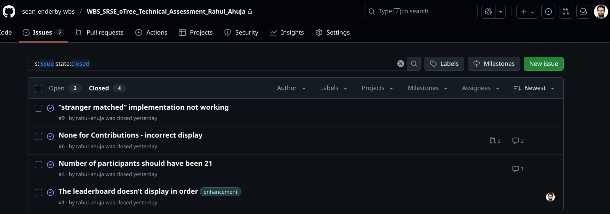
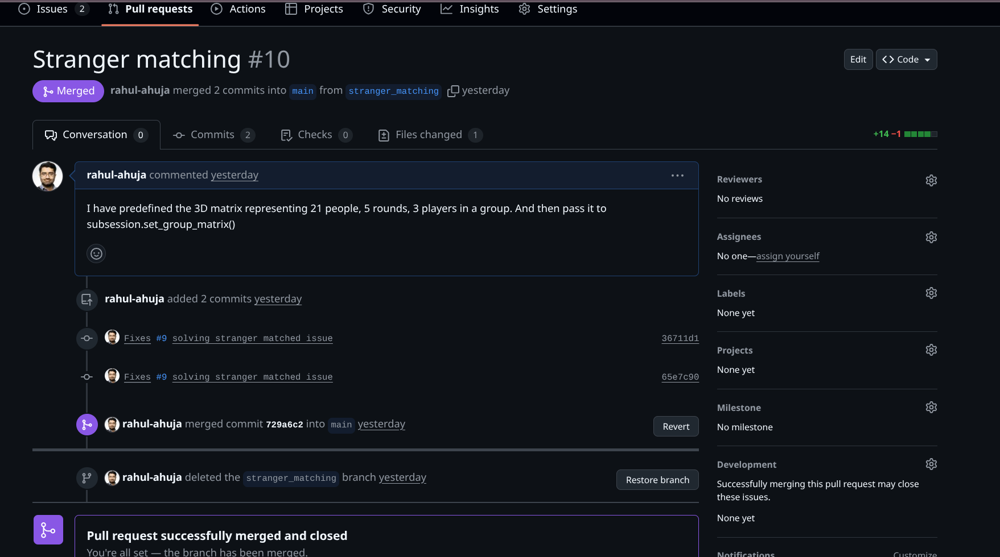

# Considerations to host the OTree application online used by the participants from Prolific platform 

1. Server Setup

In the Prolific [2] study setup, we need to provide the URL to the Prolific platform. This is a direct link that participants will follow from their Prolific dashboard to start the experiments. Prolific will take care of the user authentication and privacy, complying with GDPR.  

We need to put the application into the production and serve it to the user participants who can be anywhere in the world, accessing from Prolific. Easiest option will be to host the OTree application on OTree Hub online. They will take care of infrastructure, resources scaling, latency of the requests, and high availability of the application, accessiblility over the internet. OTree Hub will give us a URL that can be pasted in to the Prolific.

Another option is to make use of the Heroku platform as suggested in [1]. In this repository, I see Procfile which is usually used by Heroku. Therefore, I will be discussing deployment on Heroku. We can push the application directly from the GitHub to the Heroku remote server. Heroku recognizes the Procfile as a file that specifies a process to run on their Linux containers called dyno. Heroku is known as a platform as a service. It is fully managed and developer mainly has to focus on the application rather than on the infrastructure such as hardware, operating systems and networking resources to host the application to the end users. 

To scale the application, Heroku servers can be configured with NGINX and Gunicorn & Uvicorn. As mentioned in [3], we can use Nginx as a reverse proxy to serve static files efficiently, encrypt HTTP connections with SSL/TLS, distribute incoming HTTP traffic across multiple Uvicorn workers, and also handle the websockets. The latest version of OTree is ASGI which means that the I/O bound operations can be handled asynchronously. We can use Uvicorn to scale up the number of worker process on the multiple cores to be able to serve more requests in parrallel. I got to know about Uvicorn through FastAPI framework [4]. However, Gunicorn has more robust process management which should be used in production. But Gunicorn can only be configured with WSGI server. Therefore we can only use Gunicorn to manage Uvicorn workers.

As per [5], we should add a custom domain name of the URL. By default, the Heroku apps are hosted on the .herokuapp.com domain. Cloud’s public IP address tends to change if we stop the instance. We need to have a static Public IP that can be linked to a domain name. We should add an SSL certificate when we define a custom domain. We’ll have to provide a corresponding SSL certificate to expose the application over HTTPS. It’s a must-have in today’s world because some web browser vendors have already announced that they won’t display insecure websites in the future [5].

Lastly, if we want to have more control over the cloud resources, we can can look at the cloud providers such as AWS, Azure or Google Cloud. We can make use Virtual Machines such as AWS EC2 instance or dockerize OTree application managed in a cluster such as AWS Elastic Container serives (ECS) or Kubernetes. But in this submission, I will keep these technologies outside of the scope. Because these are huge topics themselves.   

2. Code repository management with Git & Github/Gitlab or any other remote code repository

It is very important to ensure that the codes in our application run smoothly when users are participating. Github offers collaboration tools to review each others codes before merging into the main branch to minimize any possible outages. We can utilize the Git version control system to track code changes and effectively collaborate with other developers on Github. We can create separate branches on GitHub to work on the application's new features or issues and then merge them into the main branch by creating Pull Requests for other developer(s) to review. GitHub Issues page allows others on your team to know about the application feature you are working on in the code repository. In this submission, I have made use of Git and Github features such as Branches, Issues, Pull Requests, Commits and Comments. GitHub is an excellent tool for project management and team collaboration. In the appendices, you can find the screenshots to some of my work on Github for this submission.

Github Actions can configure continuous integration and continuous deployment (CI/CD) workflow pipelines. We make commits to the changes in our codes. We need to ensure that these code changes are robust, not breaking the application. Test suite is triggered after the commits are made to ensure that any bugs are not deployed to the production environment. OTree features bots that can simulate participants playing the OTree application [7]. We can use bots as the simulated HTTP clients for stress testing the application. Upon successful continuous testing and pull request reviews, the application can be packaged to the Heroku as the CD (continuous deployment) workflow.

3. Databases

In the repository, instructions are given out to install PostgreSQL. Therefore, I will be discussing about it. In this submission, SQLite3 was created by the application. But PostgreSQL is a production grade database that should be used when serving actual users. In this project, it is easy to switch from one database to another because Django's ORM has been used. In the OTree forms [6], a model is essentially a database table and a field is a column in a table. In this way, ORMs provide uniform interface across the relational databases and we do not have to worry about the varying SQL syntax across the databases. PostgreSQL offers version control system to track changes in the schema with Alembic, concurrency and connection pooling which are not typically supported by SQLite3. PostgreSQL instance can be spin up by Heroku as an addon. We can use Psycopg2 wrapper to interact with PostgreSQL in Python applications. TODO: We can start the postgres on a seprate docker container and run the app using docker compose. This helps with loose coupling.

4. Stranger Matching Implementation

Efficient data structure and algorithms needs to be implemented for the matching of the players with the ones that they have not interacted before in the game. To implement, we need to take account of the time and memory complexity to ensure efficiency. For example, hashmaps and sets can be used to keep track of the pairs that have already interacted in the game. Hashmaps have constant lookup time complexity. In the current implementation, I have predefined the group matrix of the player that should be matched in each round. But we need to handle varying number of participants, rounds, and groups in our implementation. We also need to handle the edges cases such as number of participants can be less than the number of rounds.  

5. Other considerations

- Logs: Make sure to turn off debug mode in production. This can be done by setting the environment variable as OTREE_PRODUCTION [8]. The logs should not be displayed to the end users. But the logs should be collected from the production environment for any debugging of the issues or analysis. TODO: Check out logging from realpython

- Security: User privacy is already ensured by Prolific research platform for GDPR compliance. We also need to ensure that our own application is secured. I see that secret key and user names are hardcoded in the scripts. Instead we should put these values as an environment variables. Github secrets is used to hold the environment variables when CI/CD pipelines are triggered.

- Timeouts [9] should be implemented if waiting for other players in the OTree WaitPages [10] for too long. Players who are not responding in the group can be dropped and replaced by the bots for example. 

- Language [11]: By default English is configured in this OTree application. We can consider to host online in multiple languages. Put this in a dropdown menu

- Currency [12]: In this OTree application, GBP is configured. We can offer multiple currencies in online hosting. Put this in a dropdown menu

# References

1. https://otree.readthedocs.io/en/latest/server/heroku.html#heroku
2. https://www.prolific.com/participant-pool
3. https://otree.readthedocs.io/en/latest/server/ubuntu.html
4. https://fastapi.tiangolo.com/deployment/server-workers/#multiple-workers
5. https://realpython.com/django-hosting-on-heroku/#next-steps
6. https://otree.readthedocs.io/en/latest/forms.html
7. https://otree.readthedocs.io/en/latest/bots.html
8. https://otree.readthedocs.io/en/latest/admin.html
9. https://otree.readthedocs.io/en/latest/timeouts.html
10. https://otree.readthedocs.io/en/latest/multiplayer/waitpages.html
11. https://otree.readthedocs.io/en/latest/misc/internationalization.html
12. https://otree.readthedocs.io/en/latest/currency.html

# Appendices 

# Further

Read the documentations to answer questions like 
- having a matrix to ensure that the players are not rematched in the following rounds. I went over the similar example in the documentation. 
- ASGI rather than WSGI
- there were no endpoints in otree app. So i could not use fetch API. 

Database replication
pdf instructions for sonographer to run the gui
Trello
hardware
how much trust should we put on AI
Human Machine Collaboration
clincial trials to assess the usefulness of AI such as is it making decreasing the scanning time and helping them being in ease knowing 
that there is an assitance around, 
random sample
Play the game and observe
Write the readme docs, motivation, project setup
Read MSc - user survey and feedback as part of requirements gathering
Eventlistener in JS is like GUI in Wxpython

If we are using Bots in our application, then we cannot use reCaptcha which is to deal with DDoS.

If we analytics tier, then we cannot enable client cache unless if the analytics relies on the page viewed etc from the logs

Economists like to gather data and perform data analysis to make any conclusions about their economic approach. These experiments 
help to gather the data. Here the researcher asked in the email to ensure that the players are not rematched in the future rounds. I think this is to make sure that the players do not make any decisions based on the other players behaviour. 

Mention that you did not built deep learning model at Oxford. 

Algorithms can be used with Redis as in-memory with key-value databases.
Check out the design for this project
1. Requirements
2. Core Entities
3. API and Interface and Database Schema (important) 
4. Data flow
5. High level design (what are the important features of the application, high level functionalities) - just explain how the app works
6. Deep Dives
7. Recap

3.  - HTTP GET request: Get the results page, leaderboard page
    - HTTP Post request: Post the contributions

Requirements: We need the players to contribute and then give them back, stripe money,   
Non functional: latency, scalability, availability, 

Due to no rematching conditions, economist do not want players to learn other player's intentions. They want them to learn how to best maximize their own amount throughout the game. 

Presence detection
oTree detects and excludes participants who switched away to another tab or window. In order to be grouped, a user must be active on the wait page. There is a colored dot in the tab of their web page (maybe not visible on mobile). ‘🟢’ means they are considered active. ‘🟡’ means they are considered inactive. We recommend you put some text in your wait page’s body_text to tell participants to be aware of this and stay active on the page.

# note: this function goes at the module level, not inside the WaitPage.
def group_by_arrival_time_method(subsession, waiting_players):
    print('in group_by_arrival_time_method, players at the waiting page')
    m_players = [p for p in waiting_players if p.participant.category == 'M']
    f_players = [p for p in waiting_players if p.participant.category == 'F']
### If you want to access a participant’s data from a previous app, you should store this data on the participant object, which persists ### across apps
    if len(m_players) >= 2 and len(f_players) >= 2:
        print('about to create a group')
        return [m_players[0], m_players[1], f_players[0], f_players[1]]
    print('not enough players yet to create a group')

Each player types their contribution and clicks Submit.
The browser sends it to the server (liveSend).
The server (live_contribute) updates group totals and calculates the outcome.
The server broadcasts updated totals and payoffs back to all players in real time.

Having chat, enables players to cooperate/collaborate by forming a some sort of the cartel. Then we can observe if there's any cheating.

Why are you interested in this role?
Ans - Economics + Data Science background
    - Enjoyed backend project
    - Similar to what I did at Oxford. Collaborated with the research sonographers, worked on the GUI interface

Questions for the panel. Important to have a follow-up questions or repeat their answers
1. What are you looking for in the candidate
2. What projects will the postholder going to work on?
3. Tell me about the past projects and the challenges encountered in those projects
4. Can you tell me about the responsibilities in this role, senior role?
5. Can you tell me about the tech stack, I understand Django, Otree, Javascript, HTML being used. What else?

Because we are not rematching, the players cannot form any trust so it will hard to cooperate. 

        Making use of NGINX, Uvicorn is a vertical scaling.

Testing also contains form validation similar to pydantic data validation, 

To deploy to Heroku, you should use oTree Hub

If users are experiencing slow page load times and your your dyno load stays above 1, then you should get a faster dyno. (But don’t run more than 1 web dyno.)

oTree’s admin interface lets you create, monitor, and export data from sessions.

Code Collaboration, Teamwork, Breakdown the PR this helps reviewer not to be overwhelmed.

So players feel like they are watching a live “dashboard” of contributions. Here’s the idea:
Front-end (the player’s browser):

As soon as a player changes their contribution (e.g., moves a slider or enters a number), the browser sends a message to the server.
This happens without reloading the page.

Back-end (the live_method):
The server receives the contribution update.
It updates the player’s stored contribution.
It broadcasts the new contribution (or updated totals) to the other players in the group.

Front-end again:
Other players’ browsers receive the update.
Their displayed totals / contribution list update instantly.